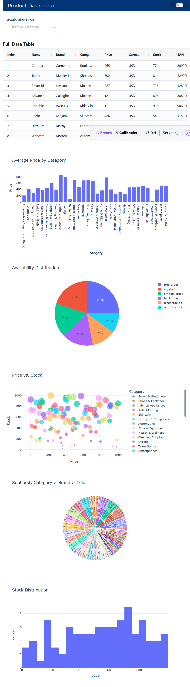
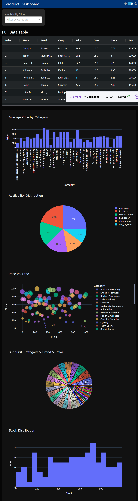
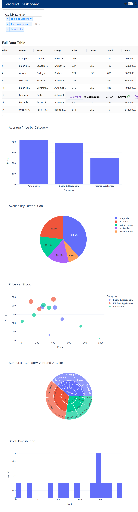
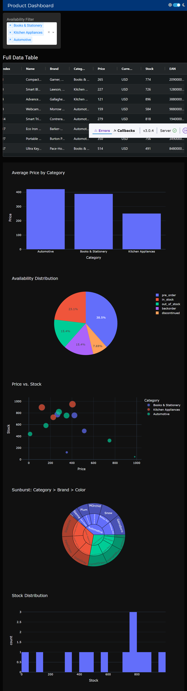

# 📊 Product Dashboard - Dash Plotly App with Light/Dark Theme

This interactive dashboard is built using [Plotly Dash](https://dash.plotly.com/), featuring:

- 🌗 Toggle between light and dark themes
- 📉 Multiple interactive visualizations
- 🧾 AG Grid table for data filtering and sorting
- 🎯 Category-based filtering
- 🧩 Bootstrap-based responsive UI

---

## 🚀 Features

- **Dropdown Filtering**: Filter products by `Category`.
- **Dark/Light Theme Toggle**: Using `ThemeSwitchAIO` and `dash-bootstrap-templates`.
- **Responsive Layout**: Built with Bootstrap components.
- **Interactive Graphs**:
  - 📊 Bar Chart – Average Price by Category
  - 🥧 Pie Chart – Availability Distribution
  - 📈 Scatter Plot – Price vs. Stock
  - 🌞 Sunburst Chart – Category → Brand → Color
  - 📦 Histogram – Stock distribution
- **AG Grid Table**: Sortable and filterable product table, theme-aware.

---

## 📦 Installation

1. **Clone the repository**:
   ```bash
   git clone https://github.com/AkashGaykar/Sample.git
   cd Sample 

2. **Create a virtual environment**
    ```bash
    python -m venv venv
    source venv/Scripts/activate
3. **Install dependencies:**
    ```bash
    pip install -r requirements.txt
4. **Run the app:**
    ```bash
    python dashboard.py
5. **View it in your browser:**
    Visit: http://127.0.0.1:8050


## 🖼️ Screenshots

- **Dashboard Without Any Category Selected (Light Mode)**
    

- **Dashboard Without Any Category Selected (Dark Mode)**
    

- **Dashboard With Category Filter Applied (Light Mode)**
    

- **Dashboard With Category Filter Applied(Dark Mode)**
    


---